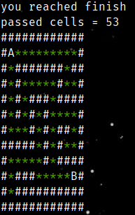
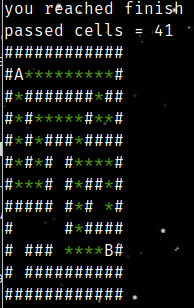
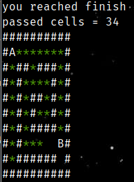
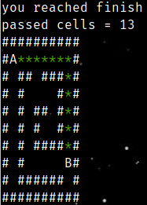

# Алгоритмы DFS и BFS
### Основы
Основой Искусственного Интеллекта (AI) являются алгоритмы поиска. Именно с этой темы начинаются курсы по Основас ИИ в университетах и различных учебниках (*как например Искусственный Интеллект. Современный подход. Рассел, Норвиг*).

Поэтому в начале своего пути изучения AI стоит уделить внимание популярным алгоритмам **DFS** и **BFS**.

### DFS и BFS
В основе этих алгоритмов лежат такие структуры данных как стек и очередь. Стек работает по философии - *последним пришел - первым ушел (LIFO)*, Очередь - *первым пришел - первым ушел (FIFO)*.

То есть по большому счету разница этих алгоритмов заключается в порядке удаления элементов из контейнера. В зависимости от удаления элементов будет изменяться путь, который будет проходить алгоритм в процессе решения задачи.

Да, эти алгоритмы ни коем образом не принимают решение о выборе направления следования в процессе решения задачи; они просто выбирают направление в порядке определенном удалением элементов из контейнера,
но это то самое примитивное, с чего отталкиваются ИИ.    

Для классического ИИ требуется уметь делать кроме поиска ещё некоторые вещи:
1. При выборе отталкиваться от дополнительного знания (так называемые эвристические функции);
2. Уметь обучаться на данных;
3. Наличие вероятностных моделей.

### Демонстрация работы
`./out_dfs maze12x12.txt`

`./out_bfs maze12x12.txt`

По результатам работы алгоритмов, что алгоритм BFS прошел меньший путь, чем DFS. Но случается и когда алгоритм DFS срабавтвает лучше алгоритма BFS. Увидеть это можно на следующем примере:

`./out_bfs maze10x10.txt`

Тут путь пройденный алгоритмом BFS составляет целых 34 клетки. А теперь посмотрим на путь пройденный DFS:

`./out_dfs maze10x10.txt`

Тут уже видно значительное улучшение относительно пройденного пути - всего 13 - прирост эффективности алгоритма больше, чем в 2.5 раза.

Выходит что эффективность этих алгоритмов очень зависит от структуры подаваемых на вход данных. Для одной стркутуры лучше подходит BFS, для другой DFS.
